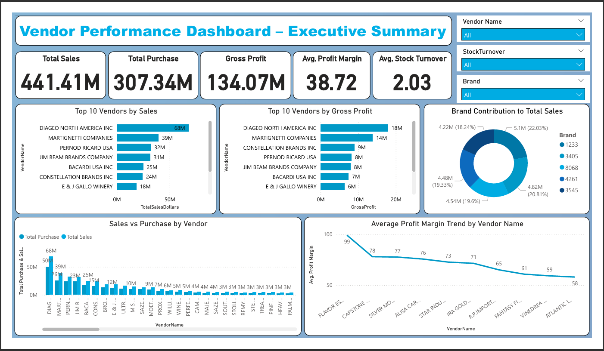
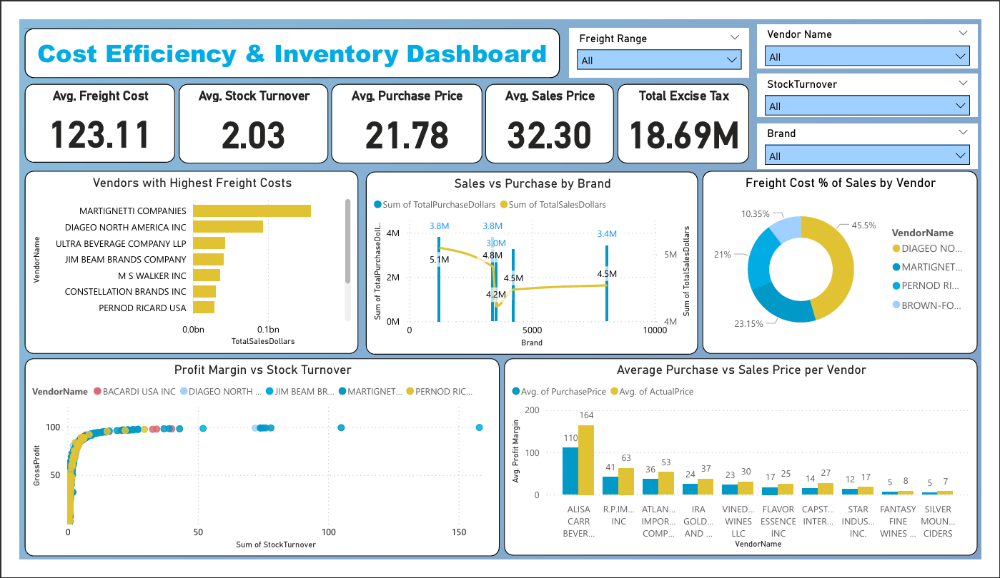

# 🏢 Retail Vendor Performance Analysis (Python + SQL + PowerBI)

      


## 📌 Overview  
This project focuses on analyzing **vendor performance, cost efficiency, and inventory optimization** using real-world retail and wholesale data.  
It combines **Python (for data ingestion, transformation, and analysis)** with **Power BI (for interactive visualization)** to deliver actionable insights for management.  

The objective is to identify **top-performing vendors**, **inefficient cost patterns**, and **profitability opportunities** to enhance strategic decision-making.  

---

## 🎯 Business Problem  

Efficient inventory and vendor management are critical for business profitability.  
This project aims to:  

- Identify **underperforming brands** requiring promotional or pricing adjustments.  
- Determine **top vendors** contributing to sales and gross profit.  
- Analyze **bulk purchasing impact** on unit cost and profitability.  
- Assess **inventory turnover** to reduce holding costs and improve efficiency.  
- Investigate **profitability variance** between high- and low-performing vendors.  

---

## ⚙️ Project Workflow  

### 🔹 1. Data Ingestion  
- Imported six raw datasets into SQLite using a Python ETL pipeline:  
  - `purchases.csv`  
  - `purchase_prices.csv`  
  - `vendor_invoices.csv`  
  - `begin_inventory.csv`  
  - `end_inventory.csv`  
  - `sales.csv`  
- Built robust scripts with **logging** and **SQLAlchemy** for data reliability and traceability.  

### 🔹 2. Data Transformation  
- Created a consolidated table **`vendor_sales_summary`** using SQL joins and feature engineering.  
- Added calculated fields for analysis:  
  - `GrossProfit = TotalSalesDollars - TotalPurchaseDollars`  
  - `ProfitMargin = (GrossProfit / TotalSalesDollars) * 100`  
  - `StockTurnover = TotalSalesQuantity / TotalPurchaseQuantity`  
  - `SalesToPurchaseRatio = TotalSalesDollars / TotalPurchaseDollars`  

### 🔹 3. Exploratory Data Analysis (EDA)  
- Conducted in-depth EDA using **Pandas**, **Matplotlib**, and **Seaborn** to identify trends and vendor performance patterns.  
- The notebook helped finalize the dataset for dashboard creation.  

### 🔹 4. Data Visualization in Power BI  
- Built two interactive Power BI dashboards to summarize KPIs and insights for management-level decision-making.  

---

## 📊 Power BI Dashboards  

### 🧭 Dashboard 1 – Executive Summary (Vendor Performance)

📸 *Preview:*  
  

### 🔍 Key Insights:

- **Total Sales:** 💰 $93.1M 

- **Total Purchases:** 🛒 $73.6M  

- **Gross Profit:** 📈 $19.5M  

- **Top Vendors by Sales & Profit**:

  - 🥇 *DIAGEO NORTH AMERICA INC*

  - 🥈 *MARTIGNETTI COMPANIES*

  - 🥉 *PERNOD RICARD USA*

- **Freight Cost**: 3.6% of Total Sales — relatively stable among high-performing vendors.

- **Profit Margin Trends**: Top vendors maintain >25% profit margins.

- **Stock Turnover Ratio**: Efficient vendors average ~1.2x inventory cycles per period.

---

### 🧾 Dashboard 2 – Cost Efficiency & Inventory  

📸 *Preview:*  
  

### 🔍 Key Insights:

- Vendors with **high freight-to-sales ratios (>5%)** show declining profit margins.

- Bulk purchasing led to an **average unit cost reduction of 72%**, proving scale efficiency.

- **Underperforming brands** identified with low Sales-to-Purchase ratios (<1.0).

- **Inventory Efficiency**: Vendors maintaining 1.0–1.5 stock turnover ratios show optimal stock management.

- Highlighted **vendor-wise profitability variance** for strategic negotiations.

---

## 📈 Overall Analytical Insights

- **DIAGEO NORTH AMERICA INC** and **MARTIGNETTI COMPANIES** dominate both sales and profit metrics.

- **Freight cost** significantly affects vendor profitability, especially for heavy-volume shipments.

- Vendors with balanced **Sales-to-Purchase ratios** and high **Stock Turnover** yield the best ROI.

- Identified opportunities for **pricing optimization and vendor diversification**.

---

## 🛠️ Tools & Technologies  

| Tool / Technology | Purpose |
|--------------------|----------|
| **Python** | Data ingestion, transformation, and cleaning using Pandas |
| **SQLite** | Database for structured storage and SQL-based aggregation |
| **Power BI** | Dashboard creation, DAX calculations, and visualization |
| **Power Query** | Data cleaning and shaping for BI integration |
| **Pandas** | Data manipulation, merging, and EDA in Python |
| **Matplotlib & Seaborn** | Exploratory data visualization and insights |
| **SQLAlchemy** | Python ORM used for database connectivity and ingestion |
| **Logging Module** | Tracks execution steps and records data pipeline events |
| **Jupyter Notebook** | Used for data exploration and performance analysis |

---

## 📁 Repository Highlights
- End-to-end company-level vendor analytics project  
- Combines Python, SQL, and Power BI  
- Includes full data pipeline, EDA, and BI dashboards  

---

## 🗂️ Project Structure  
```

📦 Vendor_Performance_Analysis
│
├── README.md                           # Project documentation
│
├── docs/
│   └── Vendor_Performance_Report.pdf     # Final Project Report 
│
├── data/
│   └── vendor_sales_summary.csv          # Final cleaned dataset used in analysis & Power BI
│
├── scripts/
│   ├── ingestion_db.py                   # Data ingestion and database creation
│   └── get_vendor_summary.py             # SQL joins and vendor summary generation
│
├── notebook/
│   ├── Exploratory Data Analysis.ipynb   # Initial data exploration
│   └── Vendor Performance Analysis.ipynb # Main analytical notebook
│
├── dashboard/
│   ├── Vendor_Performance_Analysis.pdf     # Project doc containing 2 dashboards
│   └── Vendor_Performance_Analysis.pbix    # Power BI dashboard file
│
└── images/
    ├── Executive_summary.png               # Dashboard 1 preview
    └── Cost_Efficiency_and_Inventory.png   # Dashboard 2 preview
```

---

## 🏁 Final Conclusion  

This project demonstrates how to combine **data engineering, analytics, and business intelligence** for decision-making at a company level.  

✅ Identified top and underperforming vendors  
✅ Analyzed freight cost efficiency and stock turnover  
✅ Improved understanding of sales-to-purchase profitability  
✅ Delivered executive-level dashboards for actionable insights  

---

## 🚀 Future Enhancements  
- Automate data refresh from live databases  
- Build predictive models for vendor performance forecasting  
- Integrate Power BI service for real-time dashboard updates  

---

## 🧑‍💻 Author

**👤 Shakeer Shaik**  
📍 Data Analyst | Python | SQL | Power BI | Excel | Data Visualization  
📬 [LinkedIn]((https://www.linkedin.com/in/shakeer-shaik-508958235/)) 

📧 [harshbelekar74@gmail.com](mailto:shakeershaik489@gmail.com)

---

⭐ *If you liked this project, don’t forget to star the repo and connect with me on LinkedIn!*
